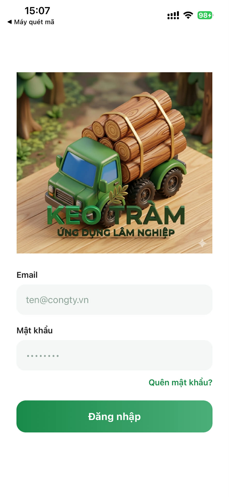
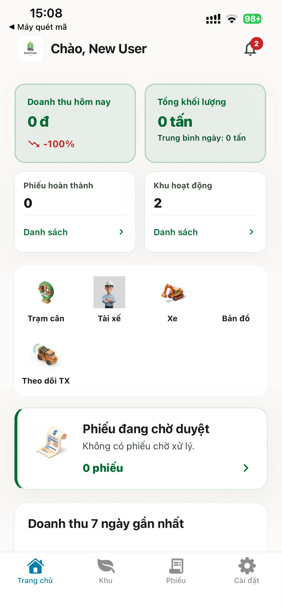
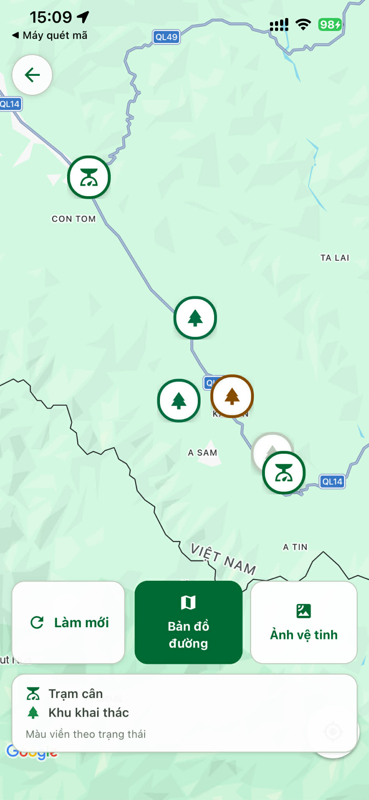
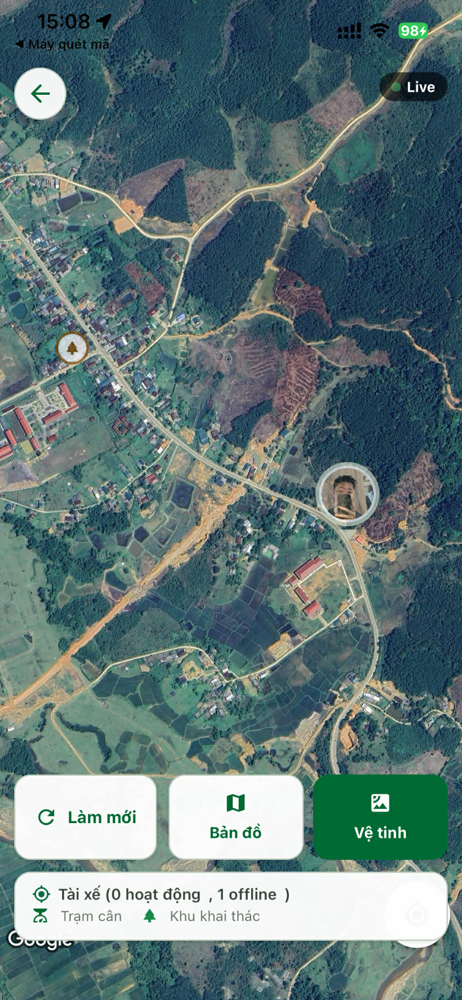
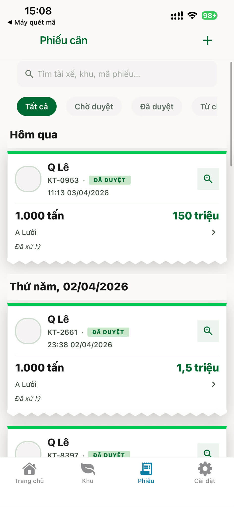

# keo-logistics

Monorepo mã nguồn mở cho **KeoTram Ops** — ứng dụng vận hành và tài chính cho chuỗi vận chuyển / khai thác gỗ keo tràm: tài xế và chủ thầu làm việc trên mobile (Expo), API NestJS xử lý nghiệp vụ, phê duyệt phiếu, bản đồ và báo cáo.

[](LICENSE)

## Ảnh màn hình (ứng dụng)

<p align="center">
  
  
  
  
  
</p>

## Monorepo

| Thư mục | Mô tả |
| ------- | ----- |
| [`keo-app/`](keo-app/) | Ứng dụng mobile / web (Expo Router) |
| [`keo-be/`](keo-be/) | Backend REST (NestJS, TypeORM) |
| [`docs/`](docs/) | BRD và Postman collection (hợp đồng API) |

## Tính năng chính (tóm tắt)

- Đăng nhập, phân quyền theo vai trò (tài xế, chủ thầu, admin).
- Chuyến xe, phiếu cân / receipt, trạm cân và khu khai thác.
- Theo dõi vị trí và bản đồ vận hành.
- Báo cáo / tổng hợp tài chính theo nghiệp vụ sản phẩm.

Chi tiết nghiệp vụ: [`docs/business.md`](docs/business.md).

## Chạy local

```bash
# App
cd keo-app && npm install && npm start

# API (biến môi trường: xem keo-be/.env.example)
cd keo-be && npm install && npm run start:dev
```

## Tài liệu

- [BRD — KeoTram Ops](docs/business.md)
- Postman: [`docs/postman/keotram-ops-api.postman_collection.json`](docs/postman/keotram-ops-api.postman_collection.json) — biến `baseUrl` thường kèm `/api/v1`
- Schema DB: [`keo-be/KEO_Ops_database.md`](keo-be/KEO_Ops_database.md)

## Làm việc với AI / quy trình feature

Backend trước (API + Postman + BRD), app sau: [`AGENTS.md`](AGENTS.md), cùng `.cursor/rules/` và `.cursor/agents/`.

## Đồng bộ từ repo con (git subtree)

```bash
git fetch keo-app main && git subtree pull --prefix=keo-app keo-app main -m "Sync keo-app"
git fetch keo-be main && git subtree pull --prefix=keo-be keo-be main -m "Sync keo-be"
```

## CI

[`.github/workflows/ci.yml`](.github/workflows/ci.yml): lint và test theo package khi push/PR vào `main`.

## Giấy phép

Dự án phát hành theo [LICENSE](LICENSE) (MIT). Bạn có thể đổi dòng copyright trong `LICENSE` cho đúng tên / tổ chức của bạn.

Phần `keo-be/` xuất phát từ [nestjs-boilerplate](https://github.com/brocoders/nestjs-boilerplate) (Brocoders, MIT); bản quyền gốc của boilerplate xem [`keo-be/LICENSE`](keo-be/LICENSE).
